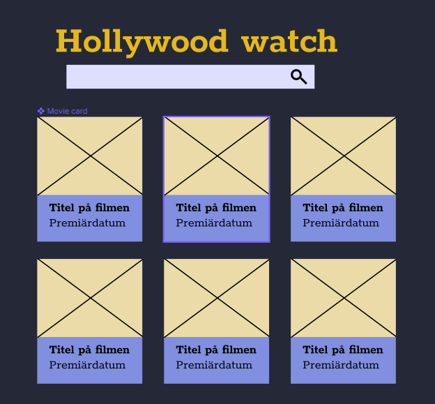

## Hollywood watch

Vi ska bygga en React-app där vi kan se information om filmer. Det finns en mockup över hur UI ska se ut, samt [en Figma-skiss](https://www.figma.com/file/93VmRM7ipcNDKzxUyjwQ3Q/Hollywood-watch?node-id=0%3A1) som är bra om man vill kunna zooma och plocka färger och teckensnitt.

Sidan består av en rubrik, ett sökfält, och en grid med movie cards i tre kolumner. Ett movie card visar information om filmer: bild, titel och premiärdatum.

)

### Mappstruktur
Skapa nya mappar i din `/src`:
+ `models/`  - för TypeScript-interface
+ `assets/`  - för bilder på filmposters och ikoner
+ `search/`  - feature folder: sökfältet
+ `movieGrid/` - feature folder: movie cards

### Gör detta
Detta ska göras i projektet. Du behöver inte göra alla punkterna i ordning.

1. Bygg en prototyp med HTML och CSS, som liknar Figma-skissen.

1. Gör om prototypen som en React-app med TypeScript. Det går bra att lägga allt i App-komponenten. Senare ska vi flytta ut det i nya komponenter.

1. Lägg in realistisk (helst riktig) data för minst fyra filmer som en state-variabel i App-komponenten. En film ska beskrivas av ett typescript-**interface**.

1. Flytta ut sökfältet och cards i egna komponenter.

1. När man skriver i sökfältet ska det ändra vilka cards som visas.

1. Skapa en favicon för appen och ändra titel i index.html

1. Möjlighet att ändra titel och premiärdatum genom att klicka på texten i ett card

1. Hover-effekter på cards och sökfältet

1. Möjlighet att lägga till ett nytt kort (finns inte i mockup - börja med att lägga till det)

1. Möjlighet att ändra ordning på korten (finns inte i mockup - börja med att lägga till det)

1. Använd [`localStorage`](https://developer.mozilla.org/en-US/docs/Web/API/Window/localStorage#example), `JSON.parse` och `JSON.stringify` för att spara filmerna i webbläsaren.

1. Om du hinner: titta på hur man kan använda Recoil eller Redux för att hantera state enklare.
