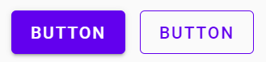
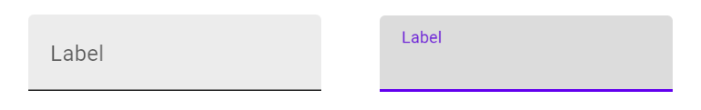
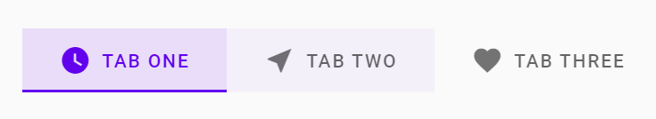

## React
[Tillbaka till start](README.md)

<style>
.hint, span.hint code { color: darkgray; background: darkgray; }
</style>

*Innan du börjar: Övningarna kommer inte i ordning. Om du märker att vi inte har gått igenom något du behöver för att lösa en uppgift, gå vidare till nästa och återvänd till den senare.*

*&ast;Svårare uppgifter är markerade med &ast;asterisk/stjärna.*

## 1 CSS, state, props
1 Skapa en ny React-app med create-react-app. Installera React Developer Tools i din webbläsare. Prova att starta appen och inspektera den i webbläsaren.

Exempelkod:

```bash
# Obs! Använd engelska tecken och bindestreck när du hittar på
# namn till din app. Vissa npm-paket har svårt för
# specialtecken. Exempel: "Min häftiga app" --> "my-awesome-app".
npx create-react-app namnet-på-din-app --template typescript
cd namnet-på-din-app/
atom .   # code . om du kör VS Code
npm run start
```

2 Ta bort standardkoden i App.jsx/App.tsx och App.css. Ersätt den med din egen kod. Gör en app som renderar texten "Hello!". Styla texten med CSS.


3 Lägg till kod i appen, som gör att den kan växla utseende mellan "dark mode" och "light mode". Använd ett eller flera button-element.
Tips: <span class="hint">använd en state-variabel med `useState` och attributet `className`</span>.



4a Skapa två button-komponenter: en "primary button" och en "ghost button". Försök att likna bilden så mycket du kan. (bild från googles Material Design)

4b Kombinera dina buttons i en komponent. Använd `props` för att bestämma om den ska visas som *primary* eller *ghost*. Exempel: `<MyButton type="primary" />`

4c* Gör så att din komponent triggar ett event när användaren klickar på knappen. Det är för att parent component ska kunna lyssna på klick, precis som vanliga button-element. Exempel:
` <MyButton @click={handleClick} /> `



5* Skapa en input-komponent enligt bilden. Den till höger är när användaren klickat i komponenten, för att skriva i den.
Tips: <span class="hint">använd CSS padding och ett label-element istället för att ha placeholder. Positionera label ovanpå input med `position: absolute`</span>.




6 Skapa en `Tab`-komponent, alltså en komponent där man kan välja den flik vars innehåll ska visas. Komponenten består av en "header" och en "content". I header ska en rad med klickbara alternativ visas. Content ska ha ett innehåll som varierar beroende på vilket alternativ som är valt. Varje alternativ ska ha tre utseenden: *normalt*, *hover* och *selected* - se bilden. Denna uppgift handlar om *conditional rendering*.
```js
// data som ska visas av tab-komponenten
[
	{ title: 'Orangutang', content: 'Orangutanger finns i Malaysia och Indonesien. De har långa armar och rödaktigt, ibland brunaktigt, hår. Namnet kommer ifrån det malajiska och indonesiska uttrycket Orang Hutan som betyder skogsmänniska.' },
	{ title: 'Gorilla', content: 'Gorillor är ett släkte marklevande växtätande primater i Afrika. De är den största arten primater, med lika lång kropp som en människa men axelbredare och avsevärt tyngre. Gorillorna är människans närmast levande släkting efter schimpanserna.' },
	{ title: 'Babian', content: 'Babianer är ett släkte i familjen markattartade apor. Släktets namn kommer från fornfranska "babine" och syftar på den framskjutande nosen.' }
]
```


7 Skapa en "spoiler" komponent. Den ska visa en button med texten "spoiler warning". När man klickar på den ska button bytas ut mot en text. Det handlar till exempel om att man inte vill avslöja slutet på en bok eller en film.


8a Gör en `Switch`-komponent. Den ska visa texten "Dark mode", som kan vara på eller av. (bilden visar ett exempel, googles Material Design)

8b Gör så att texten på komponenten är utbytbar. Texten ska skickas från parent component med *props*. Lägg till flera stycken `Switch`-komponenter i din app, för att kontrollera

8c* Gör så att appen ändrar utseende när switchen är på. Tips: <span class="hint">du behöver använda tekniken lifting state up, dvs skicka ett event</span>.


9a Skapa en komponent som kan räkna - en Counter. Den ska ursprungligen visa värdet `0`, alltså när den renderas första gången. Lägg till knappar med texten "+1" och "-1". När man klickar på dem ska värdet som visas uppdateras.

9b Lägg till en knapp med texten "Reset", som kan återställa värdet till 1.

9c Lägg till knappar med texten "`+5`" och "`*2`".

9d&ast; Gör så att en lista med tidigare värden också visas.

9e&ast;&ast; När man klickar på ett tidigare värde, ska komponenten byta till det värdet. Gör också en "Ångra"-knapp, som kan backa till det näst senaste värdet. Tips: <span class="hint">du behöver två state-variabler, det räcker inte med en</span>.


10a Listor. Gör en app som kan visa vilka böcker du läser. (eller TV-serier, musik, vad du vill) Appen ska visa en lista med titlar. Om man klickar på ett element i listan, så ska appen visa meddelandet "Du läser _vald bok_" - lägg in namnet på den valda boken.

10b Gör så att det listelementet som man har klickat på är markerat med CSS. Till exempel annan färg. Tips: använd en ny state-variabel.

10c&ast; När du gått igenom *lifting state up* - lägg listan i en egen komponent.


11 Simulera biljettbokning. Skapa två komponenter: `TicketManager` och `Visitor`. Den förra ska ha ett begränsat antal bokningsbara biljetter, till exempel 10. Den ska innehålla minst tre Visitor-komponenter. Varje Visitor ska kunna boka biljetter. När man gör en bokning ska TicketManager visa antalet tillgängliga biljetter, alltså hur många som finns kvar. Det ska bara gå att boka om det finns biljetter kvar. Tips: <span class="hint">Visitor kan använda +1 och -1 buttons för att välja antal som ska bokas. Använd disabled-egenskapen för att stänga av knappar som man inte ska kunna använda</span>.


12a&ast; Gör en "Book" komponent. Den ska visa _delar av_ ett av Shakespeare's verk: [https://www.gutenberg.org/files/100/100-0.txt](https://www.gutenberg.org/files/100/100-0.txt) . (Använd inte hela, kopiera ca 1000 tecken från filen.) Komponenten ska alltså innehålla en längre sträng, men bara visa 200 tecken åt gången. Under texten ska det finnas två knappar med texten "Previous" och "Next". När man klickar på "Next" ska nästa sida visas.

Tips 1: <span class="hint">den totala texten ska vara en sträng, som inte behöver ändras. Använd en konstant</span>.

Tips 2: <span class="hint">texten som ska visas varierar beroende på vilken sida man är på. Använd state-variabler för _sidnummer_ och _text som ska visas_</span>.

12b Styla komponenten så att det ser ut mera som en bok.

12c&ast;&ast; Om man alltid visar exakt 200 tecken, så kan det brytas mitt i ett ord. Gör så att komponenten visar _högst_ 200 tecken, så att inga ord bryts av i mitten. (obs extrasvår)

---

## 2 Komponentkommunikation

[Lifting State Up – React](https://reactjs.org/docs/lifting-state-up.html)

1 Förbättra spoiler-komponenten (uppgift 1.7) så att den tar texten som ska visas med _props_.

2a Vanliga checkboxes är för tråkiga. Gör en komponent som ska göra samma sak som en checkbox: man ska kunna klicka på den, och i stället för kryss i en ruta ska den visa olika bilder. Använd state. Som bilder kan du använda emojis, de går att kopiera in direkt i strängar. 🙂 😒   [https://emojipedia.org/](https://emojipedia.org/)

Exempel på hur man skriver ut en emoji i HTML på bästa sätt:
```<span role="img" aria-label="sheep">🐑</span> ```


2b&ast; Gör så att din egen checkbox kan visa fler än två bilder. Använd en array. När man klickar ska komponenten visa nästa bild i arrayen. Om man kommer till slutet ska första bilden visas igen.

2c Flytta _state_ till parent component. Checkboxen ska alltså inte ha någon egen state, utan få sitt värde via props. Använd tekniken "lifting state up" för att skicka state mellan parent och child.

3 Skapa en komponent som visar en lista med "Todo items", och en komponent där man kan skriva in en ny item. Exempel: TodoList-komponenten kan innehålla följande HTML
```
<div className="todo-list">
	... här visas en lista med tidigare todos

	<div> ← detta ska vara en egen komponent
		<input type="text" placeholder="Write a new todo" />
		<button> Add todo </button>
	</div>

</div>
```

4a Bygg en karusell. Dvs. en komponent som kan visa flera bilder, fast bara en åt gången. Bilderna ska man skicka till komponenten i en array, med props. Användaren ska kunna klicka för att visa nästa eller föregående bild. Man ska också kunna se vilken som visas för tillfället.

4b Parent component ska informeras när bilderna byts. Komponenten ska visa ett meddelande, till exempel "Nu visas bild nummer 2". Använd tekniken lifting state up.

---

## 3 CSS

*Fler övningar med CSS*

1a Skapa en komponent PrimaryButton som visar en typisk "call to action" button. Det är en button som är stylad för att visa att det är den här som användaren rekommenderas använda. Ofta med starkt färgad bakgrund och vit text, samt en hover-effekt. Använd en CSS-klass och en CSS-fil Button.css som du importerar i komponenten. Inspireras av: https://blog.hubspot.com/marketing/call-to-action-examples

1b Skapa en GhostButton. Det är en knapp med genomskinlig bakgrund och samma färg på kantlinje och text.

1c Animera hover-effekterna.

2 Bygg en grundläggande layout i App-komponenten med header, footer och main. Skapa CSS-variabler i index.css eller App.css i `:root {}` för de viktigaste färgerna. Se detta som en träning i att bygga en bra, flexibel layout, som du kan använda i andra projekt. Du ska ha CSS-variabler för:


* primär bakgrundsfärg (största delen av sidan, det som inte är header eller footer)
* primär textfärg
* bakgrundsfärg i header och footer (samma)
* textfärg i header och footer

3 Skapa eller ladda ner en eller två bilder. Använd import och &lt;img src> för att länka in dem i en komponent.

4 Animera karusell-komponenten i övning 7.5.

5 Gör en meny, som användaren kan klicka för att expandera. Givetvis animerad. När man klickar ska innehållet visas. Menyn som man har klickat på ska vara markerad.

Tips: använd CSS-klasser, transition och :hover.
